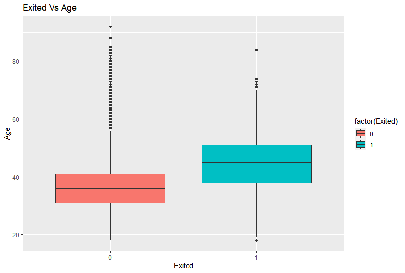
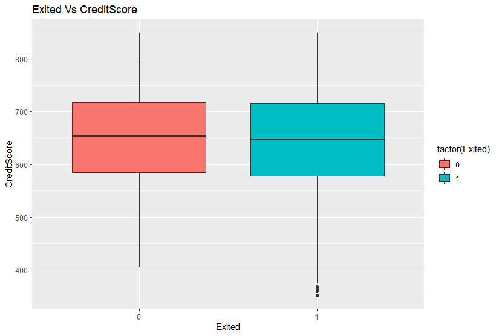
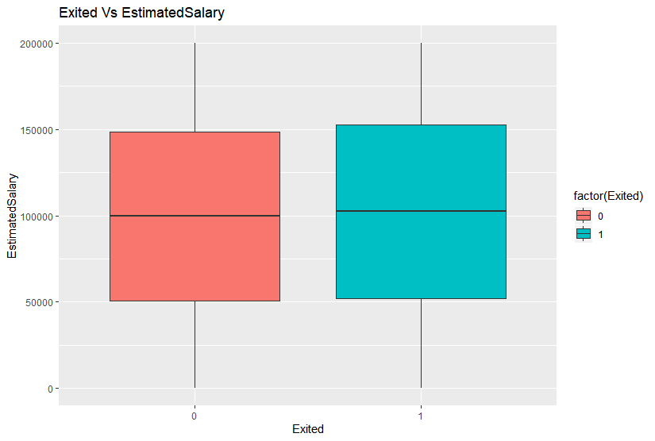
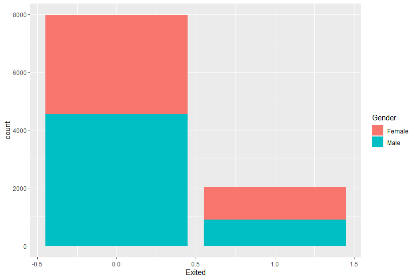

# Deep-Learning
This analysis is related to the deep learning which follows human brain learning process to detecting object and making the decision. 
# Data Introduction
In this project I deal with a open source data set, that you can installed from the following link. The data set contain's the detailed infromation about the customer and response variable is the binary variable denoting whether a customer left the bank or continue to be a customer.
This is open source data that any one can utilize from the following link.
## Objective
- Using these features trained ANN for predictive purpose, so that we can classified status of a the bank customer 

## Exploratory Data Analysis

  
   
  
   
  

#### Installation 
### contributor info
- maidul husain <mhusain@isrt.ac.bd>

